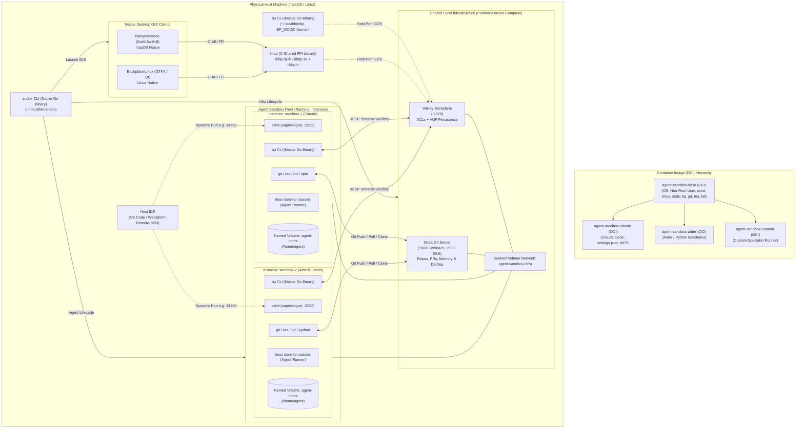
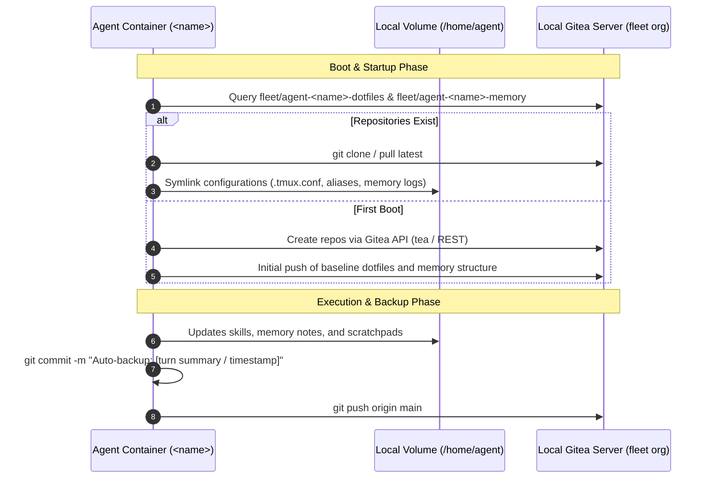

# Agent Sandbox Architecture & Specification

## 1. Executive Summary & Vision

The **Agent Sandbox** is a local, host-managed, multi-agent containerization platform designed to run autonomous AI coding agents safely in isolated environments on physical machines (macOS / Linux).

The repository is structured as a **Go monorepo**, with native compiled Go CLI utilities (`sndbx`, `bp`) and a shared core client library (**`libbp`**) that compiles both as an internal Go module and as a C-compatible shared library (`libbp.dylib` / `libbp.so`) for native macOS and Linux GUI frontends.

### Key Design Pillars
1. **Go Monorepo with Native Static Binaries**: Core CLI utilities (`sndbx` and `bp`) and shared libraries are written in Go. They compile into self-contained, statically linked binaries without runtime dependencies (no Node or script interpreters required for host or backplane tooling).
2. **Unified Core Client Library (`libbp`) with C-ABI FFI**: All protocol logic, Valkey RESP drivers, stream parsing, ACL enforcement, and Ed25519 cryptographic signing live in `libbp`. In addition to native Go imports, `libbp` exports a C-compatible API (`libbp.h`, `libbp.dylib`, `libbp.so`), allowing native macOS (Swift/SwiftUI) and Linux (GTK/Qt) GUI applications to share identical protocol logic with zero drift.
3. **Layered Container Architecture (Neutral Base vs. Derivative Agent Images)**: The base OCI sandbox image is strictly neutral and agent-agnostic. It provides the base OS, unprivileged user environment, SSH daemon, Git tooling (`git`, `tea`, `bd`), compiled `bp` CLI, and tmux supervisor without installing any specific AI agent runner. Downstream derivative Dockerfiles extend this base image to provide specific agent runners (e.g., Claude Code, Codex, Aider, OpenCode) and specialist toolchains.
4. **Container Boundary as Safety Model**: Agents run as non-root users inside containers with a broad command allow-list (`acceptEdits` mode for supported agents). Because containers are sandboxed from the host filesystem and privileged host services, agents can execute standard development lifecycles (`git`, `tea`, `npm`, `rm`, file creation, compilers) without requiring per-command human approval prompts.
5. **Strict Host Secret Isolation**: No host credentials, personal SSH private keys, or cloud access tokens are ever baked into images or mounted directly from host directories. All secrets are scoped via `.env` and injected strictly via container environment variables or per-instance dedicated credentials.
6. **Dedicated Cross-Agent Messaging Backplane**: A Valkey/Redis-powered bus providing broadcast (`bp say`) and point-to-point (`bp tell`) messaging, backed by per-agent Valkey ACLs, standard Go `crypto/ed25519` cryptographic message signing, and scheduled reactive turn wakeups.
7. **Local Git Server Infrastructure (Gitea)**: A host-local Gitea instance on the shared network providing a real Git remote, code collaboration platform, PR review affordances, and git-native task tracking via `bd` (Beads).
8. **Agent Memory & Dotfile Remote Persistence**: Beyond container volumes, agents maintain remote Git repositories on the local Gitea instance to back up their dotfiles, custom shell configurations, session reflections, and long-term memory artifacts across container destructions and instance migrations.
9. **Unified Host Tooling Suite (`sndbx`)**: A single unified binary entry point (`sndbx`) managing instance lifecycles (`sndbx agent`), shared infrastructure (`sndbx infra`), repository upgrades (`sndbx repo`), and desktop monitor launches (`sndbx gui`), adhering to XDG filesystem standards.

---

## 2. System Architecture



---

## 3. Go Monorepo Structure & `libbp` Subprojects

The repository is organized as a unified Go monorepo. Shared logic (Valkey RESP protocol, signing, runtime container management, configuration) is modularized in `pkg/`, while standalone binary applications live in `cmd/` and C exports live in `lib/`.

```text
agent-sandbox/
├── go.mod                                  # Monorepo Go module definition
├── go.sum
├── Makefile                                # Monorepo build automation (build-cli, build-libbp, build-images)
├── SPEC.md                                 # Architecture & system specification
├── cmd/
│   ├── sndbx/                              # Unified Sandbox Host Management CLI
│   │   ├── main.go
│   │   └── commands/                       # Subcommands: agent, infra, repo, gui
│   │       ├── agent.go
│   │       ├── infra.go
│   │       ├── repo.go
│   │       └── gui.go
│   ├── bp/                                 # Cross-Agent Backplane Messaging CLI (uses pkg/libbp)
│   │   ├── main.go
│   │   └── commands/                       # Subcommands: say, tell, recv, human, peers, status, finger
│   │       ├── say.go
│   │       ├── tell.go
│   │       ├── recv.go
│   │       ├── human.go
│   │       ├── peers.go
│   │       ├── status.go
│   │       └── finger.go
│   ├── retention-sweep/                    # Stream maintenance & retention daemon/CLI
│   │   └── main.go
│   └── libbp-c/                            # C-Shared FFI Export Wrapper (buildmode=c-shared)
│       ├── main.go                         # //export declarations exposing C ABI
│       └── exports.go                      # Data marshaling and callback bridges
├── pkg/
│   ├── libbp/                              # CORE BACKPLANE CLIENT ENGINE (Pure Go)
│   │   ├── client.go                       # Client connection & authentication lifecycle
│   │   ├── stream.go                       # Stream readers, writers, cursors (XADD, XREAD)
│   │   ├── guard.go                        # Argument & command safety assertions
│   │   ├── signing.go                      # Ed25519 signing & verification (crypto/ed25519)
│   │   ├── protocol.go                     # Wire message structs & payload encoding
│   │   └── resp/                           # Zero-dependency, high-throughput RESP parser
│   │       ├── reader.go
│   │       └── writer.go
│   ├── runtime/                            # Podman/Docker engine interface, port mapping, volume mgmt
│   │   ├── container.go
│   │   ├── compose.go
│   │   └── ssh.go
│   ├── gitea/                              # Gitea API client for provisioning and memory/dotfile sync
│   │   ├── client.go
│   │   └── backup.go
│   └── config/                             # XDG paths, .env parser, ACL rendering
│       ├── xdg.go
│       ├── env.go
│       └── acl.go
├── infra/
│   ├── docker-compose.yml                  # Shared Valkey & Gitea infrastructure stack
│   └── valkey/
│       └── render-valkey-acl.sh            # Valkey ACL file generation from .env
├── images/
│   ├── base/                               # AGENT-AGNOSTIC BASE OCI IMAGE
│   │   ├── Dockerfile                      # Multi-stage build; imports compiled bp binary
│   │   ├── entrypoint.sh                   # Base lifecycle: SSH setup, Gitea sync, Valkey announce
│   │   ├── sshd_config                     # Unprivileged SSH daemon configuration (port 2222)
│   │   └── tmux.conf                       # Tmux color and keybinding configurations
│   └── agents/                             # DERIVATIVE AGENT OCI IMAGES
│       ├── claude/
│       │   ├── Dockerfile                  # FROM agent-sandbox-base; installs Claude Code CLI
│       │   ├── claude-settings.json        # Claude Code broad allow-list (acceptEdits)
│       │   └── agent-entrypoint.sh         # Claude-specific reactive cron launch prompt
│       ├── aider/
│       │   ├── Dockerfile                  # FROM agent-sandbox-base; installs Python & Aider
│       │   └── aider-settings.yml          # Aider configuration
│       └── generic/
│           └── Dockerfile                  # Template for custom agent harnesses
└── tools/
    ├── gui-mac/                            # Native macOS Swift/SwiftUI Backplane App
    │   ├── Package.swift                   # Links libbp.dylib via Swift C-interop / modulemap
    │   └── Sources/BackplaneMac/
    └── gui-linux/                          # Native Linux GUI Backplane App (GTK4 / Libadwaita or Qt)
        ├── CMakeLists.txt / Cargo.toml     # Links libbp.so
        └── src/
```

---

## 4. `libbp` Core Client & C-ABI FFI Architecture

### 4.1 Pure Go Core (`pkg/libbp`)
The `pkg/libbp` package serves as the canonical implementation of the Agent Backplane Protocol:
- **Connection & Authentication**: Manages TCP/TLS connections to Valkey, handles `AUTH <user> <password>` handshake, verifies ACL permissions, and executes automatic reconnection with backoff.
- **Stream Operations**: Implements high-level operations for `<id>:out`, `<id>:inbox`, `<id>:cursor`, `<id>:status`, and `<id>:finger` using an optimized, zero-dependency RESP encoder/decoder.
- **Cryptographic Provenance**: Signs outgoing payloads and verifies inbound message signatures using Go standard library `crypto/ed25519`.
- **Client-Side Guardrails (`guard.go`)**: Enforces defense-in-depth safety checks preventing accidental destructive mutations (e.g. blocking `MAXLEN`/`MINID` flags against peer streams).

### 4.2 C-ABI Dynamic Library Export (`cmd/libbp-c`)
To enable native GUI applications (macOS Swift, Linux GTK4/Qt) to interact with the backplane without reimplementing the protocol, `cmd/libbp-c` compiles into a shared C library:
- **Build Target**: `go build -buildmode=c-shared -o dist/lib/libbp.[dylib|so] ./cmd/libbp-c`
- **Output Artifacts**: Dynamic shared library (`libbp.dylib` on macOS, `libbp.so` on Linux) and C header file (`libbp.h`).

#### Example C-ABI Export Interface (`libbp.h`)
```c
#ifndef LIBBP_H
#define LIBBP_H

#include <stdint.h>
#include <stdbool.h>

typedef struct bp_client bp_client_t;

typedef struct {
    char* id;
    char* sender;
    char* destination;
    char* content;
    int64_t timestamp;
    int64_t seq;
    bool is_signed;
    bool is_verified;
} bp_message_t;

typedef struct {
    bp_message_t** messages;
    int count;
} bp_message_list_t;

// Connection & Lifecycle
bp_client_t* bp_client_create(const char* host, int port, const char* username, const char* password, const char* signing_key_pem);
void bp_client_free(bp_client_t* client);

// Core Messaging
int bp_say(bp_client_t* client, const char* content, const char* blob_path, char** out_msgid);
int bp_tell(bp_client_t* client, const char* recipient, const char* content, char** out_msgid);
int bp_reply(bp_client_t* client, const char* msgid, const char* content, char** out_msgid);

// Stream Ingestion
bp_message_list_t* bp_recv(bp_client_t* client, int block_seconds);
bp_message_list_t* bp_human_log(bp_client_t* client, int limit);
void bp_free_message_list(bp_message_list_t* list);

// Streaming Callbacks (for GUI live reactive feeds)
typedef void (*bp_stream_callback_t)(const bp_message_t* msg, void* user_data);
int bp_subscribe_live(bp_client_t* client, bp_stream_callback_t callback, void* user_data);

#endif // LIBBP_H
```

### 4.3 Native GUI Client Integration
1. **macOS Native (`tools/gui-mac`)**: Built in Swift and SwiftUI. The Swift Package links `libbp.dylib` via an SPM `systemLibrary` target and C bridging header. Asynchronous Swift streams (`AsyncStream<Message>`) wrap `bp_subscribe_live` callbacks, rendering real-time message feeds, active peers, and operator injection interfaces.
2. **Linux Native (`tools/gui-linux`)**: Built in C++/Qt or Rust/GTK4. Direct linkage against `libbp.so` provides native system tray notifications, dark mode support, and live timeline viewing on Linux desktops.

---

## 5. Host CLI Tooling (`sndbx`)

The `sndbx` application is a compiled native Go CLI (`cmd/sndbx`) installed to `${HOME}/.local/bin/sndbx`. It serves as the single administrative entry point for the fleet and shared infrastructure.

### 5.1 CLI Domains & Commands

#### 1. Agent Domain (`sndbx agent`)
Manages independent container instances identified by unique names (e.g., `<name-1>`, `<name-2>`):
- `sndbx agent list`: Queries Podman/Docker to list running and stopped sandbox containers, agent types, dynamically allocated SSH ports, and IDE connection targets (`agent@localhost:<port>`).
- `sndbx agent start [name] [--type=<variant>] [--connect]`:
  1. Computes or retrieves the agent's Valkey ACL credentials.
  2. Generates/loads the agent's Ed25519 signing keypair.
  3. Registers the agent ACL with the live Valkey instance (`valkey-cli ACL SETUSER ...`).
  4. Launches the container instance using the specified agent image variant (`agent-sandbox-<variant>:latest`).
  5. If `--connect` is specified, attaches directly to the container's tmux session.
- `sndbx agent connect [name]`: Attaches directly to the container's running `tmux` session via `podman exec -it <container> tmux attach`. (Avoids nested host tmux to guarantee true-color TUI rendering).
- `sndbx agent ssh [name]`: Discovers the ephemeral host port assigned to the instance's `sshd` and invokes `ssh -i ~/.ssh/agent-sandbox -p <port> agent@localhost`.
- `sndbx agent stop [name]`: Stops a specified instance or all running instances.
- `sndbx agent clean [name]`: Removes container instances while preserving named data volumes (`agent-home`).
- `sndbx agent clean-login [name]`: Cleans containers while preserving agent login credentials and session state.
- `sndbx agent clean-all [name]`: Purges containers and associated data volumes for a complete wipe.
- `sndbx agent refresh [name]`: Rebuilds the OCI images, recreates the container, and preserves persistent agent volumes.

#### 2. Infrastructure Domain (`sndbx infra`)
Controls the lifecycle of shared fleet services (Valkey backplane and Gitea git server):
- `sndbx infra up`: Ensures the `agent-sandbox-infra` network exists, generates the Valkey ACL file, starts Valkey and Gitea via Compose, and verifies healthchecks.
- `sndbx infra down`: Halts shared services while keeping persistent data volumes intact.
- `sndbx infra list`: Displays status, exposed host ports, and connection strings for Valkey and Gitea.
- `sndbx infra connect <service>`: Drops into an interactive shell inside a shared infrastructure container (`valkey` or `gitea`).
- `sndbx infra clean` / `clean-all`: Stops containers with optional volume removal.

#### 3. Repository & Installation Domain (`sndbx repo`)
- `sndbx repo build`: Compiles all Go binaries (`sndbx`, `bp`, `retention-sweep`) and shared C libraries (`libbp.dylib`/`libbp.so`) for the host architecture.
- `sndbx repo upgrade`: Fast-forwards the local git repository and re-runs the Go build and setup suite.
- `sndbx repo path`: Prints the absolute path to the monorepo root.
- `sndbx repo uninstall`: Teardown of all containers, infrastructure, XDG data directories, and binary symlinks.

#### 4. Desktop GUI Domain (`sndbx gui`)
- `sndbx gui`: Detaches and launches the native Backplane desktop viewer (`BackplaneMac` on macOS or `BackplaneLinux` on Linux).

---

## 6. Layered OCI Container Architecture

```mermaid
graph TD
    subgraph BuildStage["1. Multi-Stage Go Build"]
        GoSrc["Monorepo Go Sources (cmd/bp, pkg/libbp)"]
        GoBuilder["golang:1.23-bookworm (Builder)"]
        StaticBP["Static Linux Binary: /build/bp (CGO_ENABLED=0)"]
        GoSrc --> GoBuilder --> StaticBP
    end

    subgraph BaseOCI["2. Base OCI Sandbox Image (images/base/Dockerfile)"]
        BaseOS["Debian Bookworm Slim Base"]
        UserSetup["Non-Root User: agent (UID 1000)"]
        SSHD["Unprivileged OpenSSH (:2222)"]
        TmuxConf["tmux & truecolor support"]
        VCS["CLI Utilities: git, tea, bd, jq, rg, fd"]
        BaseEntry["Base entrypoint.sh"]
        
        StaticBP -.->|COPY --from=builder| BaseOCI
    end

    subgraph DerivativeOCIs["3. Derivative Agent OCI Images (images/agents/*)"]
        subgraph ClaudeOCI["images/agents/claude/"]
            ClaudeCLI["@anthropic-ai/claude-code"]
            ClaudeSettings["claude-settings.json (acceptEdits)"]
        end

        subgraph AiderOCI["images/agents/aider/"]
            PythonEnv["Python 3.12 / venv"]
            AiderCLI["Aider Chat CLI"]
        end

        subgraph CustomOCI["images/agents/generic/"]
            CustomHarness["Custom Agent Harness / Model Client"]
        end
    end

    BaseOCI --> ClaudeOCI
    BaseOCI --> AiderOCI
    BaseOCI --> CustomOCI
```

### 6.1 Base Sandbox Image (`images/base/Dockerfile`)
The base image contains no AI agent binaries, model dependencies, or private codebases:
- **Build Mechanism**: Uses a multi-stage Dockerfile where `cmd/bp` is compiled with `CGO_ENABLED=0` against `pkg/libbp` and copied directly to `/usr/local/bin/bp`.
- **System Layer**: Minimal Debian Bookworm base with standard C runtime, `ca-certificates`, `openssl`, `locales` (`en_US.UTF-8`), `procps`.
- **Unprivileged User**: Dedicated non-root user `agent` (UID 1000, GID 1000) with home directory `/home/agent` and workspace `/home/agent/workspace`. No sudo/root escalation paths.
- **Unprivileged `sshd`**: OpenSSH daemon listening on port 2222 with custom `sshd_config`. Public keys mounted from host at runtime are copied to `~/.ssh/authorized_keys`.
- **Multiplexer**: `tmux` configured with 24-bit truecolor passthrough (`tmux.conf`).
- **Fleet Collaboration CLI Tools**:
  - `git`: Version control client.
  - `tea`: Official Gitea CLI client for PRs, issues, and repo management.
  - `bd` (Beads): Git-native distributed issue tracker.
  - `jq`, `ripgrep` (`rg`), `fd-find` (`fd`), `curl`: Essential inspection tools.
  - `bp`: Native Go backplane CLI binary.
- **Base Entrypoint (`entrypoint.sh`)**:
  1. Configures SSH host keys and imports mounted IDE public key.
  2. Executes Gitea dotfiles and memory reconciliation (`pkg/gitea`).
  3. Announces container startup to Valkey via `bp say "online (container start)"`.
  4. Launches the specified command or background tmux session.

### 6.2 Derivative Agent Images (`images/agents/<type>/Dockerfile`)
Specialized agent environments extend `agent-sandbox-base:latest`:

#### Claude Code Agent (`images/agents/claude/Dockerfile`)
```dockerfile
FROM agent-sandbox-base:latest

USER root
ENV NPM_CONFIG_PREFIX=/home/agent/.npm-global
RUN apt-get update && apt-get install -y nodejs npm && rm -rf /var/lib/apt/lists/*
RUN npm install -g @anthropic-ai/claude-code
USER agent

COPY --chown=agent:agent claude-settings.json /home/agent/.claude/settings.json

ENV PATH="/home/agent/.npm-global/bin:${PATH}"
CMD ["tmux-session", "claude"]
```

#### Aider Agent (`images/agents/aider/Dockerfile`)
```dockerfile
FROM agent-sandbox-base:latest

USER root
RUN apt-get update && apt-get install -y python3 python3-pip python3-venv && rm -rf /var/lib/apt/lists/*
USER agent

RUN pip install --no-cache-dir --user aider-chat
ENV PATH="/home/agent/.local/bin:${PATH}"
CMD ["tmux-session", "aider"]
```

---

## 7. Valkey Communication Backplane & Go `bp` CLI

### 7.1 Native Go CLI (`cmd/bp`)
The `bp` utility is written in Go using `pkg/libbp` and standard library `crypto/ed25519`.

```text
bp commands:
  bp say <msg> [--file <path>]    Broadcast message to the fleet (<id>:out)
  bp tell <agent> <msg>           Direct point-to-point message (<peer>:inbox)
  bp reply <msgid> <msg>          Reply to a specific message ID in thread
  bp recv [--block <sec>]         Read new messages from inbox and broadcast streams
  bp human                        Read authoritative operator broadcast log (human:out)
  bp peers                        List active agents discovered across the fleet
  bp status set <msg>             Set ephemeral 300s presence status (<id>:status)
  bp finger [agent]               Display identity and profile information (<id>:finger)
```

### 7.2 Key Shapes & Data Model

| Key Pattern | Owner / Writer | Purpose | TTL |
|---|---|---|---|
| `<id>:out` | Owner only | Broadcast message stream (`bp say`) | Managed by Retention Sweep |
| `<id>:inbox` | Anyone (append-only via ACL selector) | Point-to-point delivery stream (`bp tell`, `bp reply`) | Managed by Retention Sweep |
| `<id>:seq` | Owner only | Monotonic message citation counter (e.g. `<id>#42`) | Persistent |
| `<id>:cursor` | Owner only | Agent's last acknowledged read ID in streams | Persistent |
| `<id>:status` | Owner only | Ephemeral presence note | 300 seconds |
| `<id>:finger` | Owner only | Identity metadata, current assignment, role description | Persistent |
| `<id>:blob:<ts>` | Owner only | Large payload / file transfer parking key | 86,400 seconds (24h) |
| `identity:<id>` | Human / Operator only | Attested identity registry and public signing keys | Persistent |
| `human:name` | Human only | Resolves the authoritative operator username | Persistent |
| `liaison:current` | Human only | Identifies the currently appointed fleet liaison agent | Persistent |

### 7.3 Valkey ACL Model
- Default user explicitly disabled (`user default off`).
- Per-Agent ACL generated and applied dynamically:
  ```text
  user <name> on ><password> ~<name>:* %R~*:* &* +@all -@admin -@dangerous (+xadd ~*:inbox)
  ```
- Client guard in `pkg/libbp/guard.go` validates command invocations, preventing accidental `MAXLEN`/`MINID` injection on peer inboxes.

---

## 8. Local Git Server Infrastructure (Gitea)

### 8.1 Gitea Service in Shared Local Infra
Configured in `infra/docker-compose.yml`:

```yaml
services:
  gitea:
    image: gitea/gitea:1.22-rootless
    container_name: agent-sandbox-gitea
    environment:
      - GITEA__server__DOMAIN=gitea
      - GITEA__server__HTTP_PORT=3000
      - GITEA__server__ROOT_URL=http://gitea:3000/
      - GITEA__server__SSH_PORT=2222
      - GITEA__server__SSH_LISTEN_PORT=2222
      - GITEA__database__DB_TYPE=sqlite3
      - GITEA__database__PATH=/var/lib/gitea/data/gitea.db
      - GITEA__service__DISABLE_REGISTRATION=false
      - GITEA__service__REQUIRE_SIGNIN_VIEW=false
    ports:
      - "127.0.0.1:3000:3000"   # Host HTTP Web UI & REST API
      - "127.0.0.1:2223:2222"   # Host SSH Git
    networks:
      - agent-sandbox-infra
    volumes:
      - local-infra-gitea-data:/var/lib/gitea
```

### 8.2 Capabilities Provided
1. **Fleet Code Collaboration**: Central repository hosting for shared agent libraries, scripts, and feature code with PR reviews and diff viewing over `http://gitea:3000/fleet`.
2. **Issue Tracking via `bd` (Beads)**: Git-backed issue management repository (`fleet/tasks.git`) accessed via `bd ready`, `bd update --claim`, `bd close`.
3. **Automated Provisioning**: `sndbx infra up` automatically provisions the admin user, default `fleet` organization, and required seed repositories.

---

## 9. Agent Dotfiles & Memory Remote Backup Subsystem

To survive volume destruction (`clean-all`) or facilitate migration across physical machines, agents back up their state to dedicated repositories on Gitea.



### 9.1 Repository Layout per Agent
1. **`fleet/agent-<name>-dotfiles`**:
   - `bash/`: `.bashrc`, `.bash_aliases`, custom shell macros.
   - `tmux/`: `.tmux.conf` customizations.
   - `git/`: Git author configuration.
2. **`fleet/agent-<name>-memory`**:
   - `memories/`: Markdown reflections and learned knowledge.
   - `skills/`: Custom agent-authored skills and workflows.
   - `scratchpads/`: Ongoing task notes and architectural ideas.

### 9.2 Synchronization Lifecycle
- **Reconciliation on Boot**: Handled automatically in `entrypoint.sh` using the Gitea API (`pkg/gitea`).
- **Scheduled Sync**: Background cron job commits and pushes memory updates every 15 minutes.
- **Manual Command**: Direct backup triggered via `bp backup` or `sndbx agent backup <name>`.

---

## 10. Security & Threat Modeling

| Threat Vector | Mitigation Strategy |
|---|---|
| **Malicious or Broken Agent Code** | Container boundary acts as primary firewall; agents run as unprivileged UID 1000 without `sudo` access; host filesystem is unmounted. |
| **Host Secret Extraction** | Personal SSH private keys and host tokens are never mounted or copied into the container; git authentication uses local Gitea credentials or strictly scoped environment tokens. |
| **Backplane Message Forgery** | Messages are cryptographically signed with sender Ed25519 private keys; peer attestations published in `identity:<id>` keys are verified before acting on instructions. |
| **Backplane Stream Abuse / Denial of Service** | Valkey ACLs isolate writes to owner namespaces and restrict peer writes to `(+xadd ~*:inbox)`. `pkg/libbp` client guards prevent destructive `MAXLEN`/`MINID` injection. Scheduled retention sweeps prune old stream messages. |
| **Network Snooping & Spoofing** | All intra-fleet communication occurs on an isolated Docker/Podman bridge network (`agent-sandbox-infra`) bound to host localhost loopback interfaces. |
