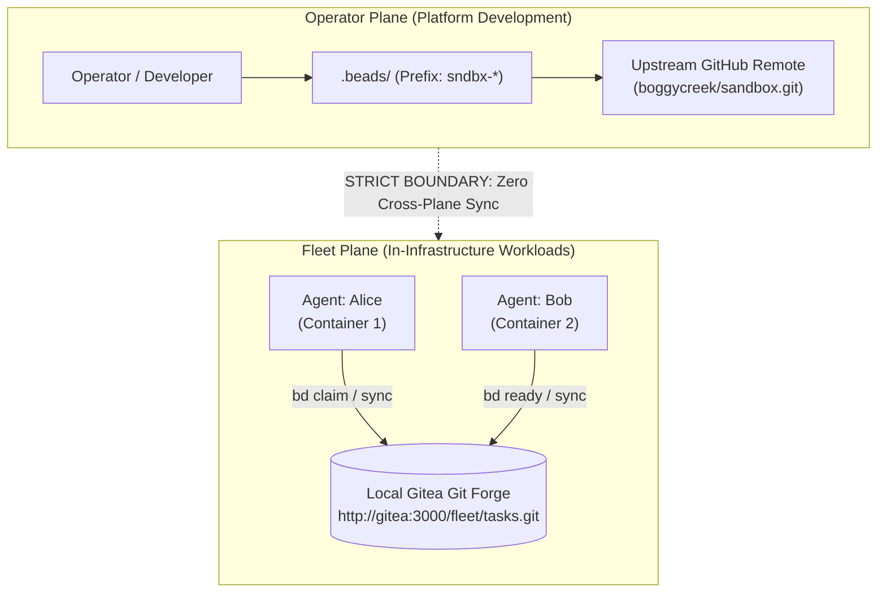

# 00028. In-Container Fleet Task Coordination via Local Gitea-Backed Beads

## Context

When multiple autonomous AI agents collaborate inside the sandbox infrastructure (e.g. Agent Alice refactoring an API while Agent Bob writes unit tests and Agent Carol updates documentation), they require a shared, machine-readable task blackboard to:
1. Decompose architectural objectives into discrete, trackable work units.
2. Express directed acyclic graph (DAG) dependencies (e.g. Task C is blocked by Task A and Task B).
3. Query unblocked work items ready for claiming (`bd ready`) without human dispatching.
4. Prevent race conditions and duplicate work through atomic task claims.
5. Record completion evidence and audit logs tied directly to git commit SHAs.

Historically, multi-agent frameworks attempted task tracking via flat `TODO.md` files in shared git repositories. This approach breaks down rapidly in concurrent multi-agent fleets:
- **Merge Conflicts**: Concurrent commits to Markdown files produce constant git merge conflicts on line numbers and bullet points.
- **No Dependency Logic**: Language models must ingest and parse the entire document on every cycle, burning context tokens and hallucinating dependency status.
- **Lost History on Reset**: When agent containers are torn down or recreated, uncommitted scratchpad notes are lost.

Conversely, offloading task management to cloud services (GitHub Issues, Jira, Linear) violates the sandbox platform's air-gap security perimeter, requires external API keys, introduces network latency, and risks leaking proprietary workload plans to third parties.

### The Two-Plane Conflation Hazard

A critical architectural pitfall in multi-agent platform design is **plane conflation**: confusing the task management system used to build the platform itself with the task management system used by autonomous agents operating *within* the platform. If the host development environment and the container fleet share or cross-pollinate issue repositories:
- Host-level platform tasks (e.g. fixing a bug in `cmd/sndbx`) get polluted with ephemeral agent experiment tickets.
- Sandboxed agents might gain unauthorized read/write access to host GitHub repositories and tokens.
- Git merge operations risk pulling agent-generated synthetic tasks into upstream production branches.

A clear, non-negotiable architectural boundary between the **Operator/Platform Plane** and the **Fleet/Workload Plane** is mandatory.

---

## Decision

We establish **Beads (`bd`)** — backed by the internal, rootless Gitea forge — as the standard task coordination engine for autonomous agents inside the sandbox fleet, while strictly isolating it from host repository development:



### 1. Architectural Invariants: The Two-Plane Separation

| Dimension | **Operator / Platform Plane** | **Fleet / Workload Plane** |
|:---|:---|:---|
| **Primary Actors** | Human developers & host coding assistants | Autonomous container agents (`alice`, `bob`, etc.) |
| **Operational Scope** | Developing `sndbx`, OCI images, ADRs, runtime Go code | Executing assigned software engineering missions |
| **Issue Prefix** | `sndbx-*` (e.g. `sndbx-cpm`) | `task-*` (or project-specific mission prefix) |
| **Remote Storage** | GitHub (`origin` / `boggycreek/sandbox.git`) | Local Gitea (`http://gitea:3000/fleet/tasks.git`) |
| **Network Boundary** | Host user network | Internal container bridge (`agent-sandbox-infra`) |
| **Persistence** | Host workstation git clones | Podman volume `agent-sandbox-gitea-data` |
| **Data Sharing** | **Zero**. No database tables, remotes, or credentials shared across planes. |

### 2. In-Container Runtime Provisioning

1. **Static Binary Inclusion**: The static `bd` binary (v1.3.0+) is bundled into `/usr/local/bin/bd` in the base agent OCI image (`images/base/Dockerfile`).
2. **Gitea Auto-Bootstrap**: When `sndbx infra up` initializes shared infrastructure, `pkg/runtime/gitea.go` ensures the `fleet` organization exists and automatically creates the bare `fleet/tasks.git` repository if absent.
3. **Workspace Initialization**: During container bootstrap or agent onboarding, the workspace configures its Dolt remote to point directly to the internal Gitea service:
   ```bash
   bd init --remote http://gitea:3000/fleet/tasks.git --prefix task --non-interactive
   ```
4. **Sub-Millisecond Air-Gapped Sync**: Agents synchronize via `bd sync` across the internal container bridge network without internet egress.

### 3. Multi-Agent Coordination Protocol

Agents interact with the fleet task graph through a standardized lifecycle:

1. **Discover Unblocked Work**: Agents execute `bd ready --json` to inspect only tasks whose dependencies are fully satisfied.
2. **Atomic Claiming**: The claiming agent runs `bd update <task-id> --claim` and immediately executes `bd sync`. Dolt’s structured cell-level merge handles concurrent claim arbitration deterministically.
3. **Progress & Subtask Decomposition**: If an agent discovers unexpected complexity, it creates child subtasks (`bd create "<subtask>" --parent <task-id>`) and defines dependencies (`bd dep add <child> <parent>`).
4. **Completion & Peer Handoff**: Upon finishing, the agent closes the task (`bd close <task-id> --reason "Implemented in <commit-sha>"`) and runs `bd sync`. This unblocks dependent tasks on the graph, causing them to immediately surface as ready for peer agents on the next `bd ready` query.
5. **Backplane Notification**: The completing agent sends a lightweight event over the backplane (`bp say "Finished task-42; unblocked task-43 for review"`), alerting peers to poll the task backlog.

---

## Consequences

### Positive
- **Deterministic Multi-Agent Coordination**: Replaces chaotic text-file scratchpads with structured, dependency-aware graph scheduling (`bd ready`).
- **Conflict-Free Merges**: Backed by Dolt version control; concurrent task creations and status updates merge cleanly at the row/cell level.
- **Air-Gapped & High Performance**: Operates entirely within the local container network (`agent-sandbox-infra`); zero cloud dependencies, sub-millisecond sync cycles.
- **Resilience Across Container Lifecycles**: Task status persists safely inside the Gitea volume (`agent-sandbox-gitea-data`). Containers can be stopped, recreated, or upgraded without losing task graph state.
- **Pristine Separation of Concerns**: Complete isolation guarantees that fleet workloads never pollute host repository issue trackers or public GitHub repos.

### Negative / Trade-Offs
- **Image Size**: Bundling the static `bd` binary adds ~30MB to the base OCI agent image.
- **Infrastructure Dependency**: In-container task synchronization requires `agent-sandbox-gitea` to be running on the shared infrastructure stack.
