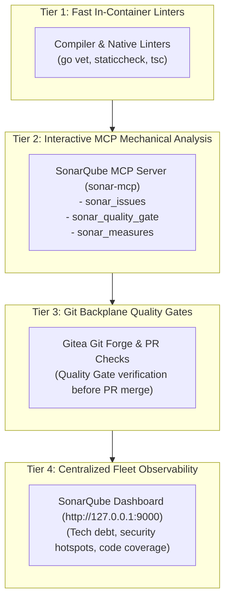

# Local SonarQube Server & Mechanical Analysis Platform

<!--
Copyright (c) 2026 Boggy Creek Software LLC

Use of this source code is governed by an MIT-style
license that can be found in the LICENSE file.
-->

Welcome to the **Local SonarQube Mechanical Analysis Platform**. The sandbox fleet provides a dedicated SonarQube Server Community Edition instance for continuous mechanical inspection, bug detection, vulnerability scanning, and automated Quality Gate enforcement.

For other platform capabilities, see the **[`INDEX.md`](INDEX.md)** hub.

---

## 1. Network Topology & Service Endpoints

| Context | Endpoint URL | Description |
|:---|:---|:---|
| **In-Container (Agent)** | `http://sonarqube:9000` | Direct container-to-container network address via `$SONAR_HOST_URL` |
| **Host System (Operator)** | `http://127.0.0.1:9000` | Forwarded loopback port on host workstation |

---

## 2. Software Quality at Depth: The 4-Tier Analysis Strategy

The sandbox architecture implements quality assurance in four synergistic layers:



1. **Tier 1 — Fast In-Container Local Verification**: Agents run language-native linters, unit tests with coverage, and deadcode checks before staging changes.
2. **Tier 2 — Interactive Agent Self-Correction via MCP**: Agents invoke `sonar-mcp` tools directly from their LLM reasoning loop to inspect detected bugs, code smells, and security hotspots on their working branches.
3. **Tier 3 — Git Backplane Quality Gate**: Gitea pull requests enforce that SonarQube Quality Gates pass (e.g. 0 blocker/critical bugs, >= 80% coverage on new code, 0 unreviewed security hotspots) before merges to `main`.
4. **Tier 4 — Centralized Fleet Observability**: Operators inspect debt trends, architectural hot spots, and quality telemetry across all agent workspaces in the SonarQube web UI.

---

## 3. Using the SonarQube Model Context Protocol (MCP) Server

The platform includes a native Go-based MCP server (`sonar-mcp`) communicating over STDIO using JSON-RPC 2.0.

### Available MCP Tools

| Tool | Purpose | Key Arguments |
|:---|:---|:---|
| `sonar_status` | Check server health and version | None |
| `sonar_quality_gate` | Evaluate if a project meets Quality Gate criteria | `project_key` (string) |
| `sonar_issues` | Retrieve mechanical issues, file paths, line numbers, and rules | `project_key`, `severity`, `issue_type` |
| `sonar_measures` | Fetch code coverage, duplicated lines %, and complexity | `project_key`, `metric_keys` |
| `sonar_create_project` | Register or initialize a project space | `project_key`, `name` |

### Example Agent Invocations

#### Checking Quality Gate Status
```json
{
  "name": "sonar_quality_gate",
  "arguments": {
    "project_key": "fleet-tools"
  }
}
```

#### Querying High-Priority Mechanical Defects
```json
{
  "name": "sonar_issues",
  "arguments": {
    "project_key": "my-workspace",
    "severity": "CRITICAL",
    "issue_type": "BUG"
  }
}
```

---

## 4. In-Container Environment Variables

The following environment variables are automatically configured in your agent container:

```bash
SONAR_HOST_URL=http://sonarqube:9000
SONARQUBE_URL=http://sonarqube:9000
```

When scanning projects using the SonarScanner CLI or language plugins, point the scanner to `$SONAR_HOST_URL`.
